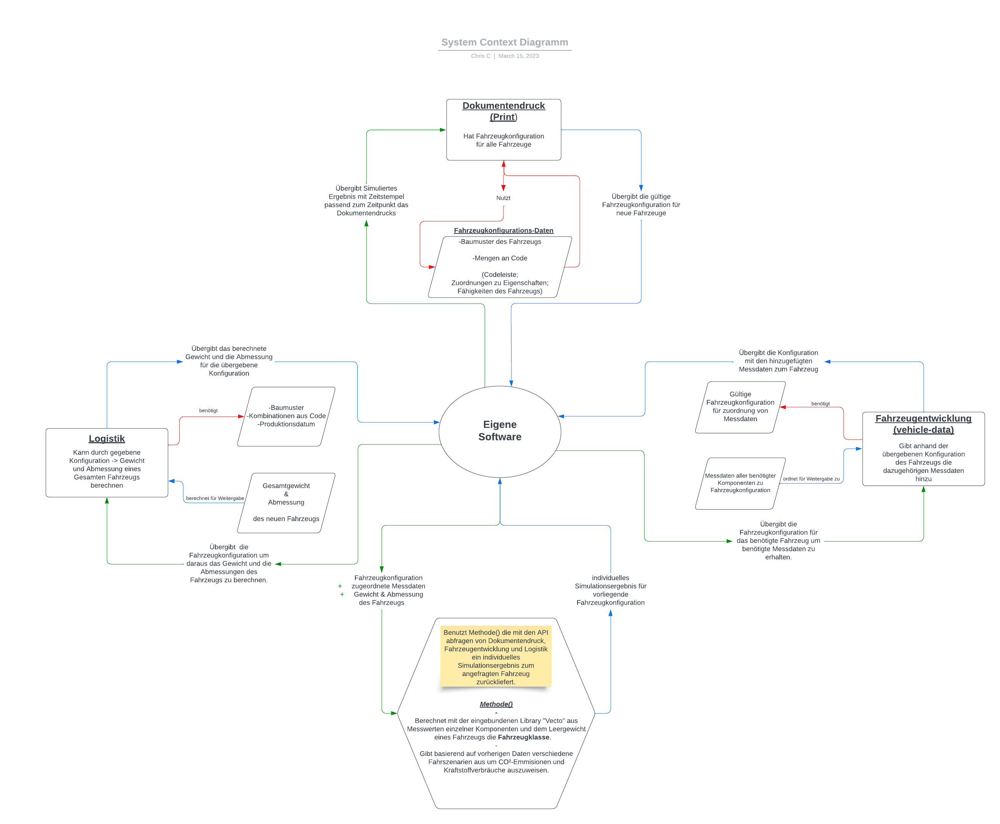
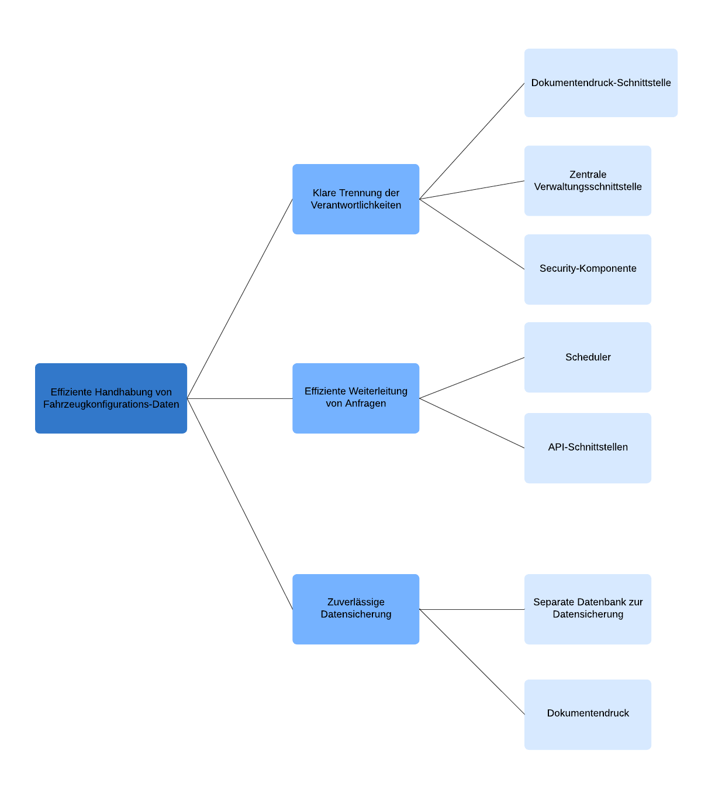

# Inhaltsverzeichnis<!-- omit in toc -->

<!-- vscode-markdown-toc -->

- [Einführung und Ziele](#einführung-und-ziele)
  - [Aufgabenstellung](#aufgabenstellung)
  - [Qualitätsziele](#qualitätsziele)
  - [Stakeholder](#stakeholder)
- [Randbedingungen](#randbedingungen)
- [Kontextabgrenzung](#kontextabgrenzung)
  - [Fachlicher Kontext](#fachlicher-kontext)
  - [Technischer Kontext](#technischer-kontext)
- [Laufzeitsicht](#laufzeitsicht)
- [Architekturentscheidungen](#architekturentscheidungen)
  - [Beschreibung der Architektur:](#beschreibung-der-architektur)
- [Qualitätsanforderungen](#qualitätsanforderungen)
  - [Anforderungen an die Architektur:](#anforderungen-an-die-architektur)
- [Qualitätsbaum](#qualitätsbaum)
- [Qualitätsszenarien](#qualitätsszenarien)
  - [Herausforderungen und Problemstellung](#herausforderungen-und-problemstellung)

<!-- vscode-markdown-toc-config
	numbering=false
	autoSave=true
	/vscode-markdown-toc-config -->
<!-- /vscode-markdown-toc -->

# Einführung und Ziele

## Aufgabenstellung

Das Ziel dieses Projekts, ist die Entwicklung einer Software, die für Neufahrzeuge entsprechende Dokumente erstellt und dabei auf Informationen der einzelnen Abteilungen zugreift. Die Abteilungen sind Dokumentendruck, Fahrzeugentwicklung und die Logistik.

Die Dokumente werden derzeit von den Abteilungen manuell erstellt. Die Dokumente werden in Papierform ausgedruckt durch den Dokumentendruck. Dies soll durch die Software vereinfacht und teilautomatisiert werden.

## Qualitätsziele

- Performance der Schnittstellen / Schnelle Antwortzeiten
- Datensendung nur gegenüber authentifizierte Schnittstellen
- ein zuverlässiges System führt jederzeit die festgelegten Funktionen durch
- das System sollte offen für Modifikationen sein, um es jederzeit zu verbessern, korrigieren oder auch an geänderte Bedürfnisse anpassen zu können
- eine benutzerfreundliche Oberfläche, die es dem Benutzer ermöglicht, die Software intuitiv zu bedienen
- eine angemessene Leistung, die es dem Benutzer ermöglicht, die Software schnell zu bedienen
- die Software bietet jede Funktionalität, die den angegebenen Bedürfnissen entspricht

## Stakeholder

**Logistik**

Unsere Software übergibt der Logistik die Fahrzeugkonfiguration, um daraus das Gewicht und die Abmessungen des Fahrzeugs zu berechnen. Diese Ergebnisse werden mit der übergebenen Konfiguration zurückgeliefert.

**Fahrzeugentwicklung**

Hier wird ebenfalls die Fahrzeugkonfiguration durch unsere Software übergeben. Als Ergebnis erhalten wir die zur Fahrzeugkonfiguration zugehörigen Messdaten des Fahrzeugs.

**Print**

Hier werden die Ergebnisse der Anfragen von Logistik und Fahrzeugentwicklung übergeben. Dieses Ergebnisse werden benutzt, um den Fahrzeugbrief drucken zu können.
Gleichzeitig erhalten wir hier die Fahrzeugkonfiguration, um daraus die Fahrzeugdaten zu berechnen.

<table>
<colgroup>
<col style="width: 25%" />
<col style="width: 25%" />
<col style="width: 50%" />
</colgroup>
<thead>
<tr class="header">
<th style="text-align: left;">Abteilung</th>
<th style="text-align: left;">Erwartungshaltung</th>
</tr>
</thead>
<tbody>
<tr class="odd">
<td style="text-align: left;">
<em>Logistik</em>
</td>
<td style="text-align: left;">
<em>Benötigt Fahrzeugkonfiguration</em>
</td>

</tr>
<tr class="even">
<td style="text-align: left;">
<em>Print</em>
</td>
<td style="text-align: left;">
<em>Benötigen simuliertes Ergebnis</em>
</td>
</tr>
<tr class="odd">
<td style="text-align: left;">
<em>Fahrzeugentwicklung</em>
</td>
<td style="text-align: left;">
<em>Erhält Fahrzeugkonfiguration</em>
</td>
</tr>
</tbody>
</table>

# Randbedingungen

Die Rahmenbedingungen für das Projekt sind die folgenden:

- Die Software soll in Java entwickelt werden.
- Die Software soll mit Datenbanken kommunizieren.
- Die Software soll alle gesammelten Daten in einem Format abspeichern, damit die Dokumente für die Neuwagen gedruckt werden können.

# Kontextabgrenzung

## Fachlicher Kontext

_Diagramm zur Darstellung der Beziehungen zwischen den verschiedenen Schnittstellen_

## Technischer Kontext

_Content Diagramm zur Darstellung der eigenen Anwendung und der internen Struktur._

# Laufzeitsicht

- Wir haben eine Dokumentendruck Schnittstelle von der Fahrzeugkonfigurations-Daten an unsere zentrale Verwaltungsschnittstelle gesendet werden.
- Diese zentrale Verwaltungsschnittstelle hat eine eigenes Web-Interface wo die Anfrage der zugesendeten Daten ankommen, diese sendet an eine Security-Komponente eine Authentifizierungsanfrage wohingegen diese Security-Komponente in einer Datenbank außerhalb die authentifikation abfragt.
- Sobald die Authentifizierung erfolgreich war, wird anhand einer **isAuthenticated()** Methode an das Web-Interface gemeldet das die Anfrage akzeptiert wurde und die Daten weitergeleitet werden können.
- Darauf hin wird die Anfrage an einen Scheduler weitergeleitet, welcher die Fahrzeugkonfigurations-Daten entgegennimmt und diese an 2 weiter API-Schnittstellen weiterleitet, die Fahrzeugentwicklung sowie die Logistik.
- Beide API´s verwenden die Fahrzeugkonfigurations-Daten um zum einen benötigte Messdaten zu der Konfiguration zu ergänzen und zum anderen benötigte Gewichtsangaben und Abmessung zum Fahrzeug beizufügen.
- Nach dem hinzufügen der Daten zur Fahrzeugkonfiguration wird jeweils das fertige Ergebnis der API´s an eine separate Datenbank zur Datensicherung geschickt und gleizeitig auch wieder als Response zum Scheduler, welcher sich in unserer Verwaltungs-Schnittstelle befindet.
- Nachdem der Scheduler eine Antwort von den API-Schnittstellen erhält, wird er die Weiterleitung an ein Kombinations-Tool initiieren. Das Kombinations-Tool wird die gesamten Daten zur Verfügung stellen, um eine Vecto Library zu vervollständigen. Anschließend wird eine Fahrtzeugsimulation berechnet, die CO2-Messdaten ausgibt. Diese Ergebnisse werden zur Datensicherung an die separate Datenbank gesendet und zeitgleich an den Absender der ursprünglichen Anfrage zurückgeschickt inklusive eines aktuelle Zeitstempels der berechneten Simulation, um den Dokumentendruck zu starten.

# Architekturentscheidungen

Wir haben uns für die folgenden Architekturentscheidungen entschieden:

- **Ein Verteiltes System welches sich aus mehreren Komponenten zusammensetzt.**

### Beschreibung der Architektur:

- Die Architektur besteht aus mehreren Schichten mit klaren Verantwortlichkeiten. Die **erste Komponente** ist die Dokumentendruck-Schnittstelle, die Fahrzeugkonfigurations-Daten an die zentrale Verwaltungsschnittstelle sendet.

- Die zentrale Verwaltungsschnittstelle stellt die **zweite Komponente** dar und dient als zentraler Punkt für die Authentifizierung und Weiterleitung von Anfragen.

- Die **dritte Komponente** ist die Security-Komponente, die in einer externen Datenbank die Authentifizierung überprüft. Die **vierte Komponente** ist der Scheduler, der die Aufgabe hat, die Fahrzeugkonfigurations-Daten an die API-Schnittstellen der Fahrzeugentwicklung und Logistik weiterzuleiten.

- Die **fünfte Komponente** besteht aus den API-Schnittstellen, die die benötigten Messdaten zur Fahrzeugkonfiguration hinzufügen und die Ergebnisse an die separate Datenbank zur Datensicherung zurücksenden. Die **sechste Komponente** ist das Kombinations-Tool, das die Daten für die Vecto Library vervollständigt und die Fahrtzeugsimulation berechnet.

- Die **siebte Komponente** ist die separate Datenbank zur Datensicherung, die für die Speicherung der Ergebnisse aus den API-Schnittstellen und der CO2-Messdaten verwendet wird. Schließlich ist die achte Schicht der Dokumentendruck, der die Ergebnisse der Fahrtzeugsimulation ausgibt und die CO2-Messdaten zur separaten Datensicherung an die Datenbank sendet.

**Insgesamt ermöglicht diese Architektur eine klare Trennung der Verantwortlichkeiten und eine effiziente Handhabung der Fahrzeugkonfigurations-Daten, wodurch ein reibungsloser Workflow gewährleistet wird.**

# Qualitätsanforderungen

### Anforderungen an die Architektur:

- **Leistungsfähigkeit**
  - Schnelle und effiziente Verarbeitung von Fahrzeugkonfigurations-Daten
  - Schnelle und effiziente Verarbeitung von CO2-Messdaten
- **Skalierbarkeit**
  - Möglichkeit zur Skalierung der Architektur, um eine steigende Anzahl von Anfragen zu bewältigen
- **Sicherheit**
  - Sichere Übertragung von Fahrzeugkonfigurations-Daten zwischen den Schichten
  - Sichere Authentifizierung und Überprüfung von Benutzerrechten
  - Schutz der Daten in der externen Datenbank und der separaten Datenbank zur Datensicherung
- **Zuverlässigkeit**
  - Zuverlässige Verarbeitung von Fahrzeugkonfigurations-Daten und CO2-Messdaten
  - Minimierung von Ausfallzeiten durch den Einsatz von redundanter Hardware und Software
- **Wartbarkeit**
  - Einfache Wartung und Aktualisierung der Architektur und ihrer Komponenten
  - Einfache Integration von neuen Funktionen und Schnittstellen
- **Benutzerfreundlichkeit**
  - Einfache Handhabung und Bedienung der Architektur für die Anwender
  - Konsistente und verständliche Benutzeroberfläche für die Dokumentendruck-Schnittstelle und das Kombinations-Tool
- **Portabilität**
  - Möglichkeit zur Portierung der Architektur auf verschiedene Plattformen und Betriebssysteme
- **Kompatibilität**
  - Kompatibilität mit verschiedenen Fahrzeugtypen und -modellen
  - Kompatibilität mit verschiedenen Tools und Bibliotheken, einschließlich der Vecto Library

# Qualitätsbaum

_Qualitätsbaum_

# Qualitätsszenarien

## Herausforderungen und Problemstellung

- Die Zusammensetzung der einzelnen Schnittstellen hat sich als sehr komplex herausgestellt, da die Daten von einer Schnittstelle an die nächste weitergeleitet werden müssen und diese wiederum die Daten an die nächste Schnittstelle weiterleiten müssen.
- Die Authentifizierung der Daten muss in einer externen Datenbank erfolgen, da diese Datenbank nicht Teil der Anwendung ist.
- Das gewählte Architekturmodell aus der Theorie in die Praxis umzusetzen war aufgrund mangelnder Erfahrung mit der Architektur sehr schwierig.
- Die einbindung der Http-Requests in die Anwendung war sehr komplex, da wir uns mit der Architektur noch nicht ausreichend vertraut gemacht hatten.
- Wir haben grundlegend erkannt das unsere kenntnisse in Java sowie der Architektur nicht ausreichend waren um die Anforderungen zu erfüllen.
