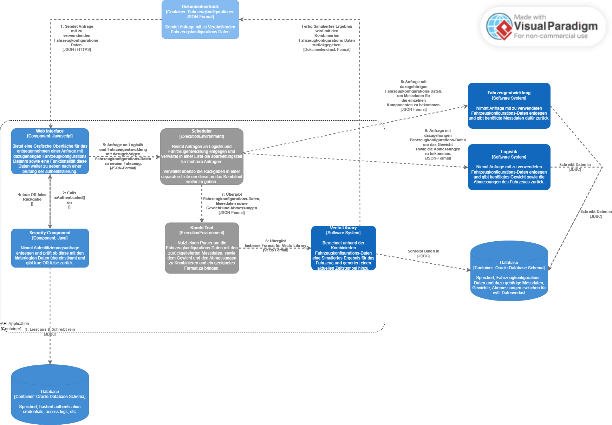

#

**Über arc42**

arc42, das Template zur Dokumentation von Software- und
Systemarchitekturen.

Template Version 8.2 DE. (basiert auf AsciiDoc Version), Januar 2023

Created, maintained and © by Dr. Peter Hruschka, Dr. Gernot Starke and
contributors. Siehe <https://arc42.org>.

# Einführung und Ziele

## Aufgabenstellung

Das Ziel dieses Projekts, ist die Entwicklung einer Software, die für Neufahrzeuge entsprechende Dokumente erstellt und dabei auf Informationen der einzelnen Abteilungen zugreift. Die Abteilungen sind Dokumentendruck, Fahrzeugentwicklung und die Logistik.

Die Dokumente werden derzeit von den Abteilungen manuell erstellt. Die Dokumente werden in Papierform ausgedruckt durch den Dokumentendruck. Dies soll durch die Software vereinfacht und teilautomatisiert werden.

## Qualitätsziele

- Performance der Schnittstellen / Schnelle Antwortzeiten
- Datensendung nur gegenüber authentifizierte Schnittstellen
- ein zuverlässiges System führt jederzeit die festgelegten Funktionen durch
- das System sollte offen für Modifikationen sein, um es jederzeit zu verbessern, korrigieren oder auch an geänderte Bedürfnisse anpassen zu können
- eine benutzerfreundliche Oberfläche, die es dem Benutzer ermöglicht, die Software intuitiv zu bedienen
- eine angemessene Leistung, die es dem Benutzer ermöglicht, die Software schnell zu bedienen
- die Software bietet jede Funktionalität, die den angegebenen Bedürfnissen entspricht

## Stakeholder

**Logistik**

Unsere Software übergibt der Logistik die Fahrzeugkonfiguration, um daraus das Gewicht und die Abmessungen des Fahrzeugs zu berechnen. Diese Ergebnisse werden mit der übergebenen Konfiguration zurückgeliefert.

**Fahrzeugentwicklung**

Hier wird ebenfalls die Fahrzeugkonfiguration durch unsere Software übergeben. Als Ergebnis erhalten wir die zur Fahrzeugkonfiguration zugehörigen Messdaten des Fahrzeugs.

**Print**

Hier werden die Ergebnisse der Anfragen von Logistik und Fahrzeugentwicklung übergeben. Dieses Ergebnisse werden benutzt, um den Fahrzeugbrief drucken zu können.
Gleichzeitig erhalten wir hier die Fahrzeugkonfiguration, um daraus die Fahrzeugdaten zu berechnen.

<table>
<colgroup>
<col style="width: 25%" />
<col style="width: 25%" />
<col style="width: 50%" />
</colgroup>
<thead>
<tr class="header">
<th style="text-align: left;">Abteilung</th>
<th style="text-align: left;">Erwartungshaltung</th>
</tr>
</thead>
<tbody>
<tr class="odd">
<td style="text-align: left;">
<em>Logistik</em>
</td>
<td style="text-align: left;">
<em>Benötigt Fahrzeugkonfiguration</em>
</td>

</tr>
<tr class="even">
<td style="text-align: left;">
<em>Print</em>
</td>
<td style="text-align: left;">
<em>Benötigen simuliertes Ergebnis</em>
</td>
</tr>
<tr class="odd">
<td style="text-align: left;">
<em>Fahrzeugentwicklung</em>
</td>
<td style="text-align: left;">
<em>Erhält Fahrzeugkonfiguration</em>
</td>
</tr>
</tbody>
</table>

# Randbedingungen

Die Rahmenbedingungen für das Projekt sind die folgenden:

- Die Software soll in Java entwickelt werden.
- Die Software soll mit Datenbanken kommunizieren.
- Die Software soll alle gesammelten Daten in einem Format abspeichern, damit die Dokumente für die Neuwagen gedruckt werden können.

# Kontextabgrenzung

## Fachlicher Kontext

_Diagramm zur Darstellung der Beziehungen zwischen den verschiedenen Schnittstellen_

## Technischer Kontext

_Content Diagramm zur Darstellung der eigenen Anwendung und der internen Struktur._

# Lösungsstrategie

# Bausteinsicht

## Whitebox Gesamtsystem

**_&lt;Übersichtsdiagramm>_**

Begründung  
_&lt;Erläuternder Text>_

Enthaltene Bausteine  
_&lt;Beschreibung der enthaltenen Bausteine (Blackboxen)>_

Wichtige Schnittstellen  
_&lt;Beschreibung wichtiger Schnittstellen>_

### &lt;Name Blackbox 1>

_&lt;Zweck/Verantwortung>_

_&lt;Schnittstelle(n)>_

_&lt;(Optional) Qualitäts-/Leistungsmerkmale>_

_&lt;(Optional) Ablageort/Datei(en)>_

_&lt;(Optional) Erfüllte Anforderungen>_

_&lt;(optional) Offene Punkte/Probleme/Risiken>_

### &lt;Name Blackbox 2>

_&lt;Blackbox-Template>_

### &lt;Name Blackbox n>

_&lt;Blackbox-Template>_

### &lt;Name Schnittstelle 1>

…

### &lt;Name Schnittstelle m>

## Ebene 2

### Whitebox _&lt;Baustein 1>_

_&lt;Whitebox-Template>_

### Whitebox _&lt;Baustein 2>_

_&lt;Whitebox-Template>_

…

### Whitebox _&lt;Baustein m>_

_&lt;Whitebox-Template>_

## Ebene 3

### Whitebox &lt;\_Baustein x.1\_&gt;

_&lt;Whitebox-Template>_

### Whitebox &lt;\_Baustein x.2\_&gt;

_&lt;Whitebox-Template>_

### Whitebox &lt;\_Baustein y.1\_&gt;

_&lt;Whitebox-Template>_

# Laufzeitsicht

## _&lt;Bezeichnung Laufzeitszenario 1>_

- &lt;hier Laufzeitdiagramm oder Ablaufbeschreibung einfügen>

- &lt;hier Besonderheiten bei dem Zusammenspiel der Bausteine in
  diesem Szenario erläutern>

## _&lt;Bezeichnung Laufzeitszenario 2>_

…

## _&lt;Bezeichnung Laufzeitszenario n>_

…

# Verteilungssicht

## Infrastruktur Ebene 1

**_&lt;Übersichtsdiagramm>_**

Begründung  
_&lt;Erläuternder Text>_

Qualitäts- und/oder Leistungsmerkmale  
_&lt;Erläuternder Text>_

Zuordnung von Bausteinen zu Infrastruktur  
_&lt;Beschreibung der Zuordnung>_

## Infrastruktur Ebene 2

### _&lt;Infrastrukturelement 1>_

_&lt;Diagramm + Erläuterungen>_

### _&lt;Infrastrukturelement 2>_

_&lt;Diagramm + Erläuterungen>_

…

### _&lt;Infrastrukturelement n>_

_&lt;Diagramm + Erläuterungen>_

# Querschnittliche Konzepte

## _&lt;Konzept 1>_

_&lt;Erklärung>_

## _&lt;Konzept 2>_

_&lt;Erklärung>_

…

## _&lt;Konzept n>_

_&lt;Erklärung>_

# Architekturentscheidungen

# Qualitätsanforderungen

**Weiterführende Informationen**

Siehe [Qualitätsanforderungen](https://docs.arc42.org/section-10/) in
der online-Dokumentation (auf Englisch!).

## Qualitätsbaum

## Qualitätsszenarien

# Risiken und technische Schulden

# Glossar

<table>
<colgroup>
<col style="width: 33%" />
<col style="width: 66%" />
</colgroup>
<thead>
<tr class="header">
<th style="text-align: left;">Begriff</th>
<th style="text-align: left;">Definition</th>
</tr>
</thead>
<tbody>
<tr class="odd">
<td style="text-align: left;">
<em>&lt;Begriff-1&gt;</em>
</td>
<td style="text-align: left;">
<em>&lt;Definition-1&gt;</em>
</td>
</tr>
<tr class="even">
<td style="text-align: left;">
<em>&lt;Begriff-2</em>
</td>
<td style="text-align: left;">
<em>&lt;Definition-2&gt;</em>
</td>
</tr>
</tbody>
</table>
